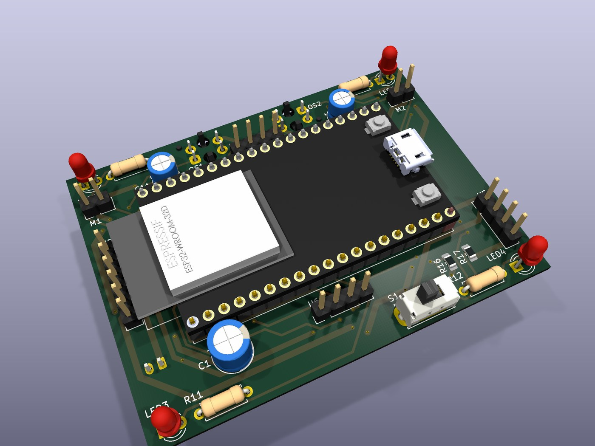
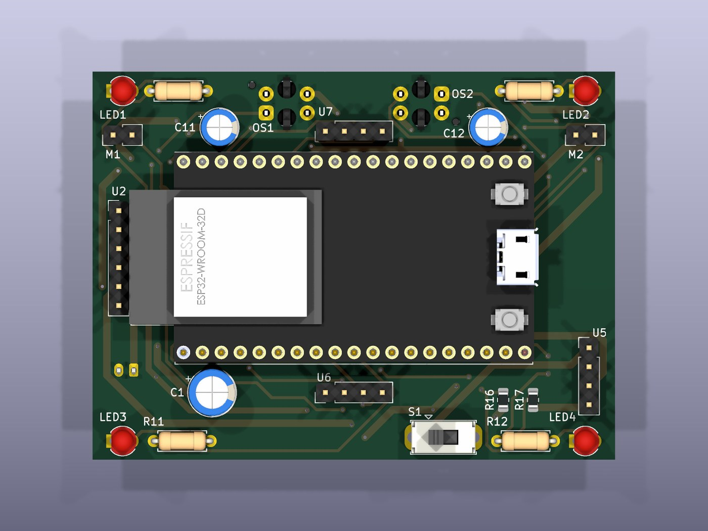
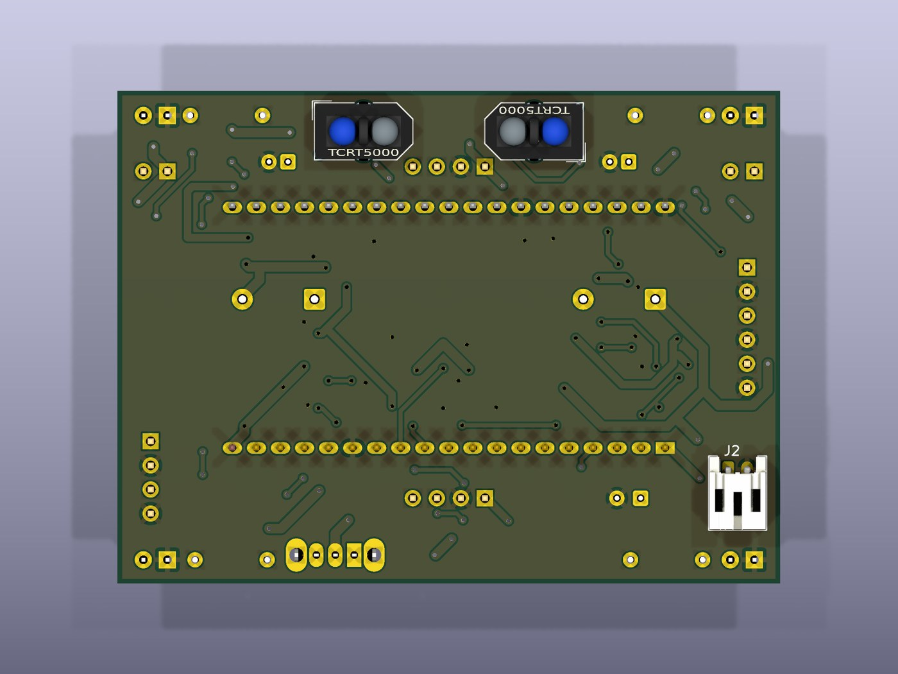

# PCB-Layout-Empfehlung

Für Variante A: DevKit gesteckt, 2-lagig, **1,0 mm FR4**, Außenmaß **50 × 38 mm**.

> **Dies ist der Entwurfstext von vorher.** Die Platine ist inzwischen gebaut
> und an einigen Stellen anders ausgefallen als hier empfohlen — vor allem
> ist sie mit **70 × 52 mm** größer geworden, weil die Fertigmodule als
> senkrechte Finnen danebenstehen. Die Zahlen, die wirklich bestellt werden,
> stehen in [Fertigung/README.md](../Fertigung/README.md). Wie sie geworden
> ist, zeigt [Abschnitt 7](#7--so-ist-sie-geworden) am Ende.

---

## 1 · Fertigungsparameter

| Parameter | Wert | Begründung |
|---|---|---|
| Lagen | 2 | Alles Nötige passt; 4 Lagen wären reine Kostensteigerung |
| Dicke | **1,0 mm** | Spart 2,2 g gegenüber 1,6 mm, bei JLCPCB zum gleichen Preis |
| Kupfer | 35 µm (1 oz) | Reicht für 1,1 A Spitzenstrom bei den unten genannten Bahnbreiten |
| Leiterbahn minimal | 0,25 mm | Weit über der Billigfertigungsgrenze, kein Aufpreis |
| Bohrung minimal | 0,3 mm | dito |
| Oberfläche | HASL bleifrei | ENIG lohnt sich hier nicht |
| Außenmaß | 50 × 38 mm | Breite durch die 25,4 mm Buchsenabstand des DevKits plus Rand bestimmt |

Bei JLCPCB kosten 5 Stück in dieser Spezifikation etwa 7 € plus Versand.

---

## 2 · Bahnbreiten und Masseführung

| Netz | Breite | Hinweis |
|---|---|---|
| VBAT (Akku → Schalter → U5) | **0,8 mm** | Spitzenstrom bis 1,1 A |
| +5 V (U5 → VIN) | **0,8 mm** | dito |
| Motorzweige (+5 V → Motor → Drain) | **0,5 mm** | ≈ 100 mA, aber impulsförmig |
| GND-Rückleitung der Motoren | **0,8 mm** | der kritischste Pfad, siehe unten |
| Signale (PWM, ADC, LEDs) | 0,25 mm | |

### Die wichtigste Layoutregel dieses Projekts

**Der Rückstrom der Motoren darf nicht durch die Massefläche laufen, die der
ADC als Bezug benutzt.** Sonst moduliert jeder Motorimpuls den Sensorwert und
der PD-Regler reagiert auf sein eigenes Rauschen.

Praktisch heißt das: **Sternpunkt-Masse.** Von einem Massepunkt direkt am
Minuspol des Akkus (bzw. am GND-Anschluss von U5) gehen drei getrennte Pfade ab:

```
            GND-Sternpunkt (am Akku-Minus / U5-GND)
             |            |              |
     Emitter Q1+Q2    DevKit GND     R7, R8, OS1, OS2 GND
     (Motorrückstrom) (Logik)        (Sensormasse)
```

Die Emitter von Q1 und Q2 bekommen eine eigene, breite Bahn zum Sternpunkt —
nicht über die allgemeine Massefläche und **nicht** über denselben Weg, den R7
und R8 benutzen. Auf der Unterseite eine durchgehende Massefläche vorsehen, aber
die Motorrückleitung als eigene Bahn darauf führen.

### Entkopplung

* **C3, C4 (100 nF)** so dicht wie möglich an den Drains von Q1 und Q2,
  Rückweg direkt zur Source desselben MOSFETs — nicht quer über das Board.
* **C1 (100 µF Elko) + C2 (10 µF Keramik)** an der 5-V-Schiene, zwischen U5 und
  der Abzweigung zu den Motoren. Also dort, wo der Puls entsteht, nicht am
  DevKit.
* **D1, D2 (Freilauf)** direkt an den Motorklemmen, Schleife so klein wie
  möglich. Eine lange Schleife strahlt die Abschaltspitze ab.

---

## 3 · Platzierung

```
                            V O R N
     ┌───────────────────────────────────────────────┐
     │  LED1◦      [OS1]      [OS2]       ◦LED2      │
     │  gelb                               gelb      │
     │  ┌──M1──┐                       ┌──M2──┐      │
     │  │Motor │  Q1 D1   C1 C2  D2 Q2 │Motor │      │
     │  └──────┘                       └──────┘      │
     │        ┌───────────────────────────┐          │
     │        │                           │          │
   ╔═╪════════╡      ESP32 DevKit V1      ╞══════════╪═╗  ← Antenne ragt
   ║ │        │   (auf Buchsenleisten)    │          │ ║    über die Kante
     │        │   darunter: LiPo 500 mAh  │          │
     │        └───────────────────────────┘          │
     │                                               │
     │   [U5 MT3608]   S1   [TP4056 + USB-C ▸]       │
     │  LED3◦                             ◦LED4      │
     │   rot                               rot       │
     └───────────────────────────────────────────────┘
                           H I N T E N
```

### Begründungen

**Antennenende über die Platinenkante.** Unter dem Antennenbereich des
DevKit-Moduls darf **kein Kupfer** liegen — keine Bahn, keine Massefläche, kein
Bauteil. Das kostet sonst Reichweite und erzeugt Verbindungsabbrüche. Das DevKit
so stecken, dass die Antenne frei über die Kante hinausschaut; im Layout dort
eine Sperrfläche (Keepout) definieren.

**Motoren weit außen und weit vorn.** Das Lenkmoment ist das Produkt aus
Vibrationskraft und Abstand zur Längsachse. Jeder Millimeter weiter außen zahlt
sich direkt in Lenkautorität aus. Weit vorn bringt zusätzlich, dass die
Vorderachse leichter ausbricht — genau das, was Lenken bei einem
Vibrationsantrieb bedeutet.

**Sensoren vorn zwischen den Motoren.** Mittenabstand OS1 ↔ OS2 passend zur
Linienbreite: bei einem 19-mm-Isolierband **15–20 mm**. Dann sieht jeder Sensor
in der Geradeausfahrt je eine Kante der Linie etwa halb verdeckt — der Punkt
mit der größten Steigung und damit der besten Regelempfindlichkeit.

**Sensorhöhe 2–5 mm über dem Boden.** Der TCRT5000 hat sein Optimum bei etwa
2,5 mm. Darüber sinkt das Signal schnell. Die Sensoren deshalb mit abgewinkelten
Beinen nach unten setzen oder die Platine entsprechend hoch lagern — und auf
gleiche Höhe beider Sensoren achten, sonst ist der Nullpunkt schief (die
Kalibrierung fängt das zwar auf, aber auf Kosten des Hubs).

**Akku mittig unter dem DevKit.** Er ist mit 10 g das schwerste Einzelteil.
Mittig heißt: Schwerpunkt auf der Längsachse, keine Schlagseite. Mit
Schaumklebeband befestigen, das entkoppelt gleichzeitig die Vibration.

**USB-C und Schalter nach hinten.** Dort kommt man beim Laden dran, ohne die
Sensorik anzufassen.

---

## 4 · Mechanik

* **Zwei getrennte Borstenfelder**, je eines unmittelbar unter M1 und M2. Auf
  einer gemeinsamen Grundplatte verteilt sich die Vibration und die Differenz
  zwischen den Motoren mittelt sich weg — der Roboter lenkt dann kaum. Das ist
  die wichtigste mechanische Entscheidung am ganzen Aufbau.
* **Borsten schräg nach hinten** anstellen (ca. 15–25° aus der Senkrechten).
  Die Vorzugsrichtung entsteht genau daraus; senkrechte Borsten vibrieren auf
  der Stelle.
* **Montagelöcher:** 4× Ø 2,2 mm für M2-Schrauben, 3 mm von den Ecken. Dienen
  gleichzeitig als Befestigung für die Borstenträger.
* **Keine Verschraubung direkt zwischen Motor und Platine.** Den Motor mit
  Schaumklebeband aufsetzen: starre Verschraubung überträgt die Vibration ins
  ganze Board (und in den Elko und die Lötstellen) statt in die Borsten.

---

## 5 · Checkliste vor der Bestellung

- [ ] Platinendicke auf **1,0 mm** gesetzt
- [ ] Keepout unter dem Antennenbereich des DevKits, kein Kupfer
- [ ] DevKit-Buchsenleisten im Raster 2,54 mm, Abstand **25,4 mm** (30-Pin-Version!)
- [ ] GND-Sternpunkt eingezeichnet, Motorrückstrom als eigene Bahn
- [ ] C3/C4 unmittelbar an Q1/Q2, Freilaufdioden an den Motorklemmen
- [ ] R13/R14 (2× 5,1 kΩ) an CC1/CC2 vorhanden — sonst lädt nichts
- [ ] R_prog = 4,7 kΩ, nicht 1,2 kΩ
- [ ] Polung der JST-PH-Buchse gegen den tatsächlich gekauften Akku geprüft
- [ ] Sensorabstand zur Linienbreite passend (15–20 mm bei 19-mm-Band)
- [ ] Beschriftung im Siebdruck: Polung des Akkus, Soll-Ausgangsspannung von U5
      („**U5 = 5V0**") direkt neben der Lötaugenreihe von U5. Der Trimmer ist
      dort nicht mehr — U5 wird vor dem Einbau auf einen Festteiler 110 k/15 k
      umgebaut, siehe [Inbetriebnahme Schritt 1a](07_Inbetriebnahme-und-Tuning.md)

---

## 6 · Nachtrag: die beiden Sensoren

### MPU-6050 (Lage) — aufs Chassis, nicht auf den Mast

Drei Regeln, und alle drei sind auf diesem Roboter nicht optional:

1. **Nahe der Drehachse.** Der Sensor misst die Drehrate um die Hochachse.
   Sitzt er weit außen, überlagert die Zentrifugalbeschleunigung die
   Lagemessung. Platz: mittig, möglichst dicht am Schwerpunkt.
2. **Weit weg von den Motoren.** Nicht wegen des Magnetfelds — das stört ein
   Gyro kaum — sondern wegen der mechanischen Anregung. Jeder Zentimeter
   Abstand hilft.
3. **Weich ankoppeln.** Mit demselben Schaumklebeband aufsetzen wie den
   Akku. Starr verschraubt bekommt der Sensor die volle Motorvibration ab,
   und die ist auf diesem Gerät das größte Messproblem überhaupt.
   Stiftleisten abknipsen und flach verlöten — ein gestecktes Modul wackelt
   im Sockel, und genau dieses Wackeln misst der Sensor dann.

### VL53L0X (Abstand) — auf den Mast

| | |
|---|---|
| Masthöhe | ca. 60 mm über der Platine |
| Position | vorn mittig, zwischen den beiden Liniensensoren |
| Blickrichtung | **waagerecht nach vorn** |
| Werkstoff | CFK-Rundstab Ø 3 mm — steif und mit 0,6 g fast masselos |

**Warum der Mast hier funktioniert, ein Magnetometer dort aber nicht:** Eine
optische Laufzeitmessung mittelt über ihr Messfenster von 33 ms. Ein
peitschender Mast verwischt dabei höchstens den Zielpunkt, nicht den
Messwert. Ein Magnetometer dagegen würde oben zwar weniger Motorfeld sehen,
dafür aber in der Mastbewegung seine Ausrichtung verlieren — und die
Ausrichtung ist bei einem Kompass die Messgröße.

**Nicht nach unten neigen.** Ein zum Boden geneigter Sensor misst die
Tischplatte und meldet dauernd „Hindernis". Waagerecht, und beim ersten
Aufbau mit der Live-Anzeige in der Oberfläche prüfen: freie Strecke muss
„frei" anzeigen, nicht einen Wert um 100 mm.

**Kabel verdrillt am Mast entlang, am Fuß eine Schlaufe lassen.** Ein straff
gespanntes Kabel bricht an einem vibrierenden Mast genau an der Lötstelle.

### Massefolgen fürs Layout

Die 4,5 g der Sensorik sitzen zu etwa der Hälfte oben. Das verschiebt den
Schwerpunkt nach vorn und nach oben. Zwei Gegenmaßnahmen, beide kostenlos:

* Akku so weit **nach hinten** setzen, wie das Layout zulässt
* PCB in **1,0 mm** statt 1,6 mm bestellen (siehe Checkliste oben) —
  das allein holt die Mastmasse mehr als zurück

---

## 7 · So ist sie geworden

Drei Ansichten der fertig gerouteten Platine. Sie kommen aus KiCad selbst
(`kicad-cli pcb render`), zeigen also exakt die Daten, die auch in die
Gerber gehen — kein nachgezeichnetes Schaubild. Neu erzeugt werden sie von
[`Fertigung/erzeuge_fertigungsdaten.sh`](../Fertigung/erzeuge_fertigungsdaten.sh).

### Gesamtansicht



**Wozu dieses Bild dient:** der schnelle Eindruck, wie hoch das Ganze baut.
Gut zu sehen ist, dass das DevKit die halbe Fläche überdeckt und auf
Buchsenleisten gut 8,5 mm darüber schwebt — darunter liegt bewusst alles
Flache. Für den Entwurf des 3D-Basismoduls ist das die Ansicht, an der man
die Bauhöhe abschätzt; die genauen Maße liefert
[`Fertigung/MarsRover-platine.step`](../Fertigung/MarsRover-platine.step).

### Oberseite



**Wozu dieses Bild dient:** die Bestückungsübersicht. Hier sieht man die
Aufteilung in drei Streifen — **vorn** die Motoranschlüsse M1/M2, die
Pufferelkos C11/C12 und der Abstandssensor U7; **in der Mitte** das DevKit
quer mit den beiden Finnen U2 (Laderegler) und U5 (Step-Up) links und
rechts; **hinten** Ladebuchse, Schalter S1, der Lagesensor U6 mittig und
die roten LEDs.

Rechts am DevKit ist der **Micro-USB** frei zugänglich — U5 stand dort
ursprünglich davor und musste dafür an die Hinterkante wandern.

### Unterseite



**Wozu dieses Bild dient:** die Unterseite ist die Seite, die den Boden
sieht, und sie trägt die Teile, auf die es beim Linienfolgen ankommt. Die
beiden **TCRT5000** stehen hier gegeneinander um 180° gedreht, so dass die
Fototransistoren nach innen zeigen; ihre optischen Messflecken liegen damit
18 mm auseinander, passend zu einem 19-mm-Band. Rechts hinten sitzt der
**liegende Akkustecker**, damit das Kabel parallel zur Platine herauskommt
und nicht in den Spalt zum darunterliegenden Akku ragt.

Die olivfarbene Fläche über die ganze Platine ist die **Massefläche**. Rund
um jedes bedrahtete Masse-Pad erkennt man den schmalen Ring der
Wärmefalle — vier Stege statt voller Anbindung, damit die Fläche beim
Handlöten die Wärme nicht schneller abzieht, als der Kolben sie nachliefert.
